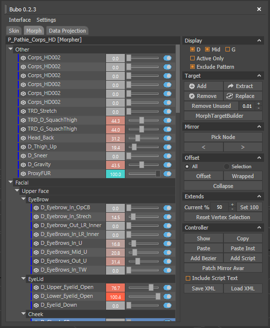

# Bubo

Copyright (c) TATProductions.

DESCRIPTION: Tool for rigging department. skin, morph/blendshape, transfert mesh datas. 
AUTHOR: Pierre Lasbignes 
DATE: 2019 

# What is it?

  Bubo is a window tool created for 3dsmax 2020-2021.
  It help riggers to skin and ad morph to their characters with extras commands.
  Some of them are:
  - Clear user interface with Skin treeview and Morph treeview with custom filters, to find | add | select | delete the wanted items quickly. 
  - Symetrie Mesh detection to mirror skin weigths.
  - Symetrie Mesh detection to mirror mropher.
  - Hold/unhold Bones to lock/unlock skin weights and perform more precise skin deformation.
  - project skin and morph to one character to another with different topology mesh.
	...

# Install & Loading 
  /!\ Warning, this project needs externals TAT libraries that might not be included. 

  - copy Bubo folder  to [yourCustomPath]
  - the commande "fileIn	[yourCustomPath]\Bubo\Mxs\Bubo.ms"  will execute the file. This is the loader of the project
	
# API

This Api can be used inside 3dsmax with maxscript scripting language.

  .\Bubo\API\API.cs
  .\Bubo\API\APIMorph.cs
  .\Bubo\API\APISkin.cs

## Global
	(void)		Bubo.ShowUI() 
	(void)		Bubo.CloseUI()
	(void)		BuboApi.Refresh() 
	(void)		BuboApi.Dispose() -- disable all events
	(void)		BuboApi.UnDispose() -- enable all events
	(void)		BuboApi.ResetConfig() -- reset xml config of treeview groups
	(bool)  	BuboApi.ProjectMorph (int) sHandle (int) dHandle (string[]) channelNames (bool) isScript (bool) isUnusedTargets (bool) createSkwIfNotExists
	(bool)  	BuboApi.ProjectSkin (int) sHandle (int) dHandle (bool) isDualQuat (bool) isUnusedBones
	(int[]) 	BuboApi.MapIndices (int) sHandle (int) dHandle
	(string) 	BuboApi.GetBasename (string) s
	(string) 	BuboApi.ReplaceBasename (string) s (string) replaceS

## Skin methods

	(float) 	BuboApi.CurrentSkinWeight -- access property of the UI
	(SkinMod) 	BuboApi.GetSkinMod (int) modifierHandle  (int) nodeHandle
	(bool)		BuboApi.SaveSkin (int) modifierHandle (int) nodeHandle  (string) filename
	(int[])     	BuboApi.GetSkinBones (int) modifierHandle
	(bool)		BuboApi.MixSkin  (int) modifierHandle  (int)  nodeHandle  (string[])  filenames   (float[])  mix
	(bool)  	BuboApi.LoadSkin (int) modifierHandle  (int)  nodeHandle  (string)  fileName
	(bool)		BuboApi.LoadSkin (int) modifierHandle  (int)  nodeHandle  (string)  fileName  (bool) onlySelected
	(bool)		BuboApi.LoadSkin (int) modifierHandle  (int)  nodeHandle  (string)  fileName  (int[]) verticesToSkin
	(void) 		BuBoApi.SetSkinWeight (int) modifierHandle (int) nodeHandle  (float) val (bool) addValue 
	(void)		BuboApi.SkinWeightPlus()
	(void)		BuboApi.SkinWeightMinus()
	(void)      	BuboApi.HoldBoneToggle()
	(void)      	BuboApi.SkinGrow()
	(void)      	BuboApi.SkinShrink()
	(void)      	BuboApi.SkinLoop()
	(void)      	BuboApi.SkinRing()
	(void)      	BuboApi.SkinNextBone()
	

## Morph methods

	(PolySym)  	BuboApi.PolySym  -- access to PolySym object , detect symmetry points of a mesh to perform copy, paste and invers position points. 
	(bool) 		BuboApi.SaveMorphChannels (int) modifierHandle (int) nodeHandle (string) filename  (string[]) channelNames
	(bool) 		BuboApi.LoadMorphChannels (int) modifierHandle (int) nodeHandle (string) filename  (string[]) channelNames  (bool) clearChannels  (bool) keepTargetNodes
	(bool) 		BuboApi.MixMorphChannels (int) modifierHandle (int) nodeHandle (string[]) filenames  (float[]) mixValues  (string[])  channelNames  (bool)  clearChannels  (bool) keepTargetNodes
